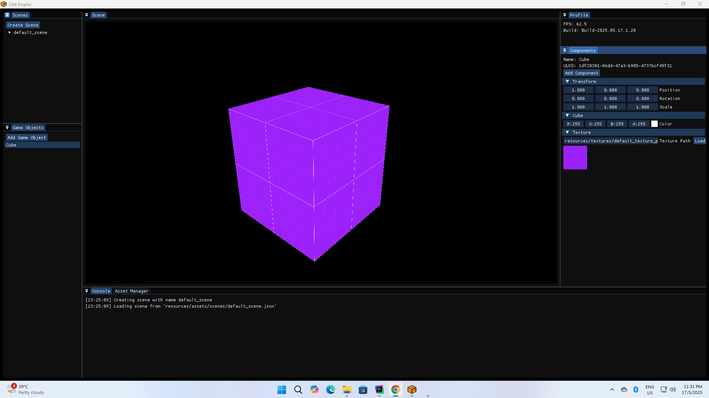

# Cbit Game Engine

## Overview
Cbit Game Engine is a project aimed at learning more about computer graphics and creating a game from scratch. This engine leverages several libraries to provide a robust framework for game development.



## Features
- Cross-platform support
- Utilizes SDL2 for window management and input handling
- Supports OpenGL for rendering
- JSON support for configuration and data management
- ImGui for GUI development

## Getting Started

To get started with Cbit Game Engine, clone the repository and follow the instructions below to set up your development environment.

```bash
git clone --recursive https://github.com/nurakmaljalil91/Cbit-Game-Engine
````

## Tools Used

1. **CMake**
    - [CMake Homepage](https://cmake.org/)
    - [CMake Documentation](https://cmake.org/documentation/)

2. **CLion**
    - [CLion Homepage](https://www.jetbrains.com/clion/)
    - [CLion Documentation](https://www.jetbrains.com/help/clion/quick-start-guide.html)

---

## Libraries Used
> Note: if you are using linux ( Debian-like ) use this command:
> ``` bash
> sudo apt update && sudo apt install -y \
> build-essential cmake \
> libsdl2-dev libsdl2-image-dev libsdl2-ttf-dev libsdl2-mixer-dev \
> libgl1-mesa-dev
> ```

1. **SDL 2 Version 2.0.10**
    - [Homepage for SDL2](https://www.libsdl.org/index.php)
    - [Learn SDL 2](http://wiki.libsdl.org/FrontPage)
2. **SDL 2 Image 2.0.5**
    - [Download SDL 2 Image](https://www.libsdl.org/projects/SDL_image/)
3. **SDL 2 TTF version 2.0.15**
    - [Download SDL2 TTF](https://www.libsdl.org/projects/SDL_ttf/)
4. **jsoncpp**
    - [jsoncpp source code](https://github.com/open-source-parsers/jsoncpp)
    - [jsoncpp documentation](http://open-source-parsers.github.io/jsoncpp-docs/doxygen/index.html)
5. **OpenGL**
    - [Main Homepage](https://www.opengl.org/)
6. **GLEW (The OpenGL Extension Wrangler Library)**
    - [Main Homepage](http://glew.sourceforge.net/)
7. **SOIL (Simple OpenGL Image Loader)**
    - [Main Homepage](https://www.lonesock.net/soil.html)
8. **Dear ImGui**
    - [Github page](https://github.com/ocornut/imgui)
9. **STB Image**
    - [Github page](https://github.com/nothings/stb)

## SDL 2 Libraries that may be needed
- `-lmingw32`
- `-lopengl32 -lSDL2`
- `-luser32 -lgdi32`
- `-lwinm -limm32`
- `-lole32 -loleaut32 -lversion`
- `-lsetupapi -lhid`

---

## References
1. **Game Programming in C++**
    - [Game Programming in C++ book by Sanjay Mandhav](https://www.amazon.com/Game-Programming-Creating-Games-Design/dp/0134597206)
    - [Source code](https://github.com/gameprogcpp/code)
2. **ECS from BirchEngine**
    - [Birch Engine github page](https://github.com/carlbirch/BirchEngine/)
3. **SFML RPG from HeadTurna**
    - [SFML RPG github page](https://github.com/Headturna/SFML_RPG)
4. **That Game Guy**
    - [That Game Guy Homepage](http://thatgamesguy.co.uk/game-engine-dev/)
    - [Github page](https://github.com/thatgamesguy/that_game_engine)
5. **SDL 2 Tutorial**
    - [Will Usher Tutorial](https://www.willusher.io/pages/sdl2/)
    - [Programmer's Ranch](http://www.programmersranch.com/p/sdl2-tutorials.html)
    - [Lazy Foo's Production](https://lazyfoo.net/tutorials/SDL/01_hello_SDL/index.php)
6. **Learn OpenGL**
    - [learnOpengl](https://learnopengl.com/)
    - [Lazy Foo's Production](http://lazyfoo.net/tutorials/OpenGL/index.php)
    - [learn-opengl](http://www.opengl-tutorial.org/)
7. **The Cherno**
    - [The Cherno YouTube](https://www.youtube.com/@TheCherno)
    - [Hazel Game Engine Github page](https://github.com/TheCherno/Hazel)

## How to build

Build for debug mode:

```bash
cmake -DCMAKE_BUILD_TYPE=Debug "-DCMAKE_MAKE_PROGRAM=C:/Users/User/AppData/Local/Programs/CLion Nova/bin/ninja/win/x64/ninja.exe" -G Ninja -S C:\Users\User\Developments\Cbit-Game-Engine -B build-debug
cd build-debug
ninja
```

Build for release mode:

```bash
cmake -DCMAKE_BUILD_TYPE=Release "-DCMAKE_MAKE_PROGRAM=C:/Users/User/AppData/Local/Programs/CLion Nova/bin/ninja/win/x64/ninja.exe" DENABLE_EDITOR:BOOL=OFF -G Ninja -S C:\Users\User\Developments\Cbit-Game-Engine -B build-release
cd build-release
ninja
```
## Author
- Nur Akmal bin Jalil

## License
This project is licensed under the MIT License - see the LICENSE file for details.
